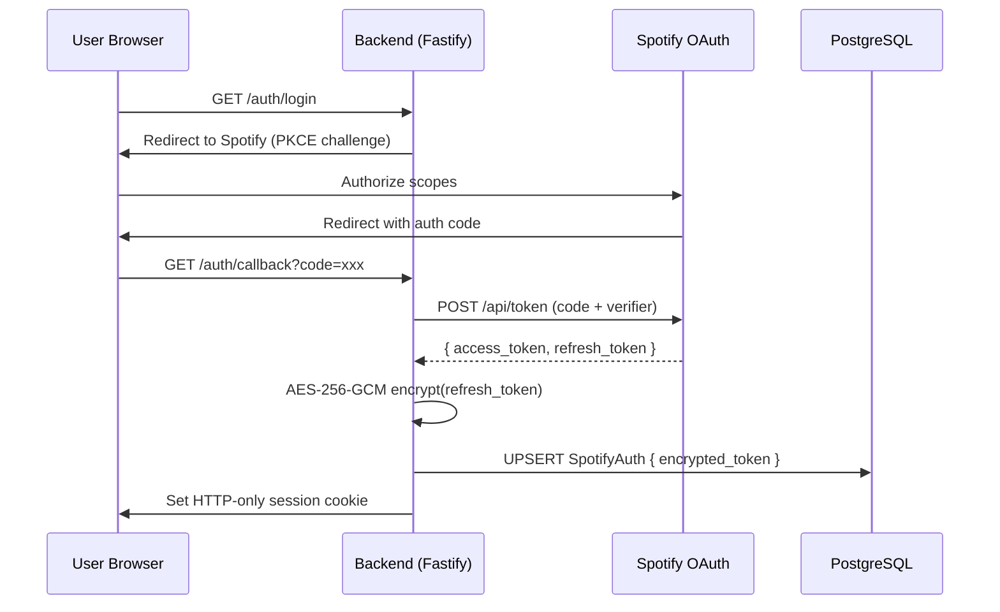
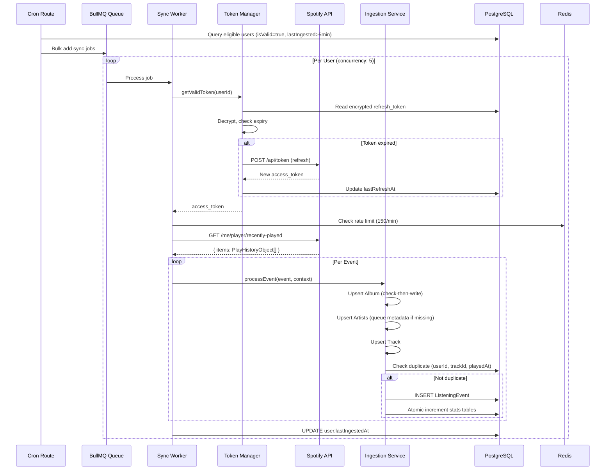

# MYI-V3: Data Flow Document

> **Scope**: Data pipelines, transformation logic, and flow critique.
>
> **Related**: [Architecture](architecture.md) | [Data Models](data_models.md)

---

## 1. Primary Data Pipelines

| Pipeline | Source | Transformation | Sink |
|----------|--------|----------------|------|
| **Auth/Token Flow** | Spotify OAuth | PKCE validation, AES-256 encryption | `SpotifyAuth` table |
| **Listening Sync** | Spotify `/recently-played` API | Deduplication, catalog upsert, incremental aggregation | `ListeningEvent`, stats tables |
| **History Import** | User-uploaded `endsong.json` | Stream parsing, source-priority merge | `ListeningEvent`, overwrite estimated data |
| **Top Stats Refresh** | Spotify `/me/top/*` API | Top 50 artists/tracks, key-value mapping | `SpotifyTopTrack`, `SpotifyTopArtist` |

---

## 2. Pipeline Deep Dives

### 2.1 Auth/Token Flow

**Data Flow**: User initiates OAuth -> Spotify returns authorization code -> Backend exchanges for tokens -> Refresh token encrypted -> Stored in PostgreSQL -> Refreshes at 50 minutes



**Transformation Details**:
- **PKCE Verifier**: Generated per-request, stored in Redis (60s TTL)
- **Encryption**: AES-256-GCM with random IV (see [System Constraints](architecture.md#5-system-constraints) for details)
- **Token Refresh**: Proactive at 50 minutes, 10 minutes before expiry

---

### 2.2 Real-Time Listening Sync (Most Complex)

**Data Flow**: Cron triggers bulk job -> Per-user worker fetches Spotify API -> Events deduplicated -> Database tables upserted -> Stats incremented.



**Transformation Details**:
- **SyncContext Cache**: In-memory Maps (albumCache, artistCache, trackCache) reduce DB queries 50-80%
- **Deduplication**: Compound unique index `(userId, trackId, playedAt)` enforces idempotency
- **Source Priority**: `IMPORT` > `API` (imports can overwrite API-estimated data)
- **Adaptive Polling**: If 50 items returned, re-queue with jittered delay (prevents data gaps)

---

### 2.3 Legacy History Import

**Data Flow**: User uploads ZIP -> Extract `endsong.json` files -> Stream parse to avoid memory bloat -> Merge into existing events with source priority.

| Stage | Action | Output |
|-------|--------|--------|
| 1. Upload | Validate file type, create `ImportJob` | `ImportJob` (PENDING) |
| 2. Queue | Add to BullMQ import queue | Job ID |
| 3. Parse | Stream JSON (100MB+ files), extract events | Array of `ParsedListeningEvent` |
| 4. Ingest | Call `ingestion.processEvent()` per event | Stats: added/skipped/updated counts |
| 5. Complete | Update `ImportJob.status` | `ImportJob` (COMPLETED/FAILED) |

**Transformation Details**:
- **Stream Parsing**: Constant memory usage regardless of file size
- **Merge Logic**: If `source=import` AND `existing.isEstimated=true` -> overwrite (import data is authoritative)
- **Progress Tracking**: `processedEvents` counter updated in batches

---

### 2.4 Top Stats Refresh

**Data Flow**: Dashboard access or daily cron triggers staleness check -> Fetch Spotify's personalization API -> Replace rankings atomically.

| Stage | Trigger | Action |
|-------|---------|--------|
| Lazy | User visits dashboard | `triggerLazyRefreshIfStale()` checks tier thresholds |
| Warm | 3 AM daily cron | `POST /cron/seed-top-stats` sweeps Tier 1/2 users |
| Fetch | Worker processes job | GET `/me/top/tracks`, `/me/top/artists` for all 3 terms |
| Store | Transaction | DELETE old rankings -> INSERT new (atomic swap) |

**Tier Definitions**:
| Tier | Activity | Refresh Frequency |
|------|----------|-------------------|
| 1 (Active) | Login within 48h | Every 24h |
| 2 (Casual) | Login 3-7 days ago | Every 72h |
| 3 (Inactive) | >7 days | On-demand only |

---

## 3. Architectural Critique

### 3.1 Data Integrity Risk: Stats Aggregation Race Condition

**The Problem**: When processing a batch of events, stats tables are updated via atomic increments (`playCount += 1`, `totalMs += N`). However, if two workers process overlapping events for the same user concurrently, such as import and sync at the same time, the following race can occur:

```
Worker A: Read playCount = 10
Worker B: Read playCount = 10
Worker A: Write playCount = 11
Worker B: Write playCount = 11  // Lost update! Should be 12
```

**Why It Happens**: While `ListeningEvent` insertion is protected by the unique constraint, the stats increment is a separate read-modify-write operation.

**Mitigation in Current Design**:
- 5-minute sync cooldown per user reduces overlap probability (changed to 30-minutes to limit GitHub Actions)
- Import jobs are typically run once per user (not concurrent with sync)
- Prisma's `update({ increment: N })` uses `SET col = col + N` which is atomic at the SQL level

**Risk**: If a user triggers an import while a sync job is in-progress, stats could lose increments. Probability: Low. Impact: Minor stat inaccuracy.

**Possible Fix** (not yet implemented): Use `SELECT ... FOR UPDATE` row locking on stats rows during aggregation, or migrate to a write-ahead log pattern where all stat changes are queued and processed serially per user.

---

### 3.2 Metadata Worker Stale Lock

If a metadata fetch fails, such as a transient Spotify error, the Redis lock prevents retries for 24 hours. This is intentional to prevent hammering the API, but results in missing metadata for a full day.

**Trade-off**: API quota preservation vs. data freshness.

---

## 4. Alternative Flow Strategies

### 4.1 Push-Based (Webhook) vs. Pull-Based (Polling)

| Aspect | Current: Pull (Polling) | Alternative: Push (Webhook) |
|--------|-------------------------|----------------------------|
| **Mechanism** | Cron triggers every 15 min | Spotify sends events to our endpoint |
| **Latency** | 0-15 min delay | Near real-time (<1s) |
| **Implementation** | Simple HTTP GET | Webhook signature validation, endpoint stability |
| **Reliability** | We control retry logic | Dependent on Spotify's retry policy |
| **API Quota** | Uses quota per poll | Zero quota usage for event delivery |

**Why Polling is Appropriate**:
1. **Spotify API Limitation**: Spotify does not offer a webhook API for listening events. This alternative is hypothetical.
2. **Acceptable Latency**: 5-15 minute delays are acceptable for analytics (not real-time gaming).
3. **Operational Control**: We can throttle, batch, and retry on our terms.

---

### 4.2 Synchronous vs. Asynchronous Processing

| Aspect | Current: Async (BullMQ) | Alternative: Sync (Request-Path) |
|--------|------------------------|--------------------------------------|
| **Dashboard Response** | <100ms (pre-computed) | 500-5000ms (on-demand fetch + aggregate) |
| **Data Freshness** | Up to 15 min stale | Real-time |
| **Error Handling** | Automatic retries, dead-letter queues | User sees errors immediately |
| **Scaling** | Horizontal (add workers) | Vertical (bigger request timeout) |
| **Complexity** | Higher (Redis, BullMQ, workers) | Lower (single request path) |

**Why Async is Appropriate**:
1. **Core Principle**: "Compute off the request path" - dashboard loads must be <100ms.
2. **User Perception**: Users tolerate slightly stale analytics but not slow page loads.
3. **Failure Isolation**: API outages don't block dashboard access; users see cached data.
4. **Scale**: At 900M+ events, on-demand aggregation is not feasible.

---

### 4.3 Event Sourcing vs. CRUD

| Aspect | Current: CRUD + Aggregation | Alternative: Event Sourcing |
|--------|-----------------------------|-----------------------------|
| **Raw Events** | Stored, aggregates maintained separately | Events are the source of truth |
| **Stats Rebuild** | Manual backfill process | Replay events to recompute |
| **Storage** | Moderate (events + aggregates) | Higher (event log + snapshots) |
| **Debug/Audit** | Limited historical trace | Full audit trail |
| **Complexity** | Moderate | High (event store, projections) |

**Why CRUD + Aggregation is Appropriate**:
1. **Read Optimization**: 99% of queries are reads; pre-computed aggregates serve them instantly.
2. **Scope**: Single-user analytics, not multi-tenant SaaS requiring full audit trails.
3. **Operational Overhead**: Event sourcing requires additional infrastructure (event store, snapshot management).
4. **Recovery**: If aggregates drift, we can rebuild from `ListeningEvent` (the immutable log).

---

## 5. Data Flow Invariants

These invariants must hold across all pipelines:

| Invariant | Enforcement |
|-----------|-------------|
| No duplicate listening events | Compound unique index `(userId, trackId, playedAt)` |
| Tokens never stored in plaintext | AES-256-GCM encryption with auth tag |
| Stats are eventually consistent | Incremental aggregation on INSERT, backfill capability |
| Partitions always exist for current/future months | Cron job `POST /cron/partition-maintenance` |
| Invalid tokens are quarantined | `isValid=false` after 3 consecutive failures |

---

### Credits

Written by Mohamed Ibrahim, formatted by Gemini.
