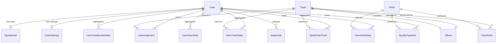

# MYI-V3: Data Models Document

> **Scope**: Static data structures, entity relationships, constraints, and schema critique.
>
> **Related**: [Architecture](architecture.md) (system topology, service boundaries) | [Data Flow](data_flow.md) (pipelines, transformations)

---

## 1. Data Models

### User Domain

| Model | Purpose | Cardinality |
|-------|---------|-------------|
| **User** | Account identity derived from Spotify OAuth. Contains denormalized counters (`totalPlayCount`, `totalListeningMs`) for O(1) profile queries. | Root entity |
| **SpotifyAuth** | Encrypted OAuth credentials. Tracks token validity and consecutive failure count for gradual invalidation. | 1:1 with User |
| **UserSettings** | Privacy and display preferences. Separated from User to avoid bloating the core identity table. | 1:1 with User |

### Music Catalog (Global, Shared)

| Model | Purpose | Cardinality |
|-------|---------|-------------|
| **Track** | Canonical track record. Referenced by all listening events across all users. | Many-to-many with Artist |
| **Artist** | Canonical artist record. Stores `genres` as a PostgreSQL array with GIN index. | Many-to-many with Track |
| **Album** | Canonical album record. Nullable FK on Track allows orphan tracks. | 1:N with Track |
| **TrackArtist** | Join table enabling N:M relationship between tracks and artists. | Composite PK (trackId, artistId) |

### Event Log

| Model | Purpose | Cardinality |
|-------|---------|-------------|
| **ListeningEvent** | Immutable append-only log. Partitioned by `playedAt` (monthly) for scale. Composite PK `(id, playedAt)` enables partition pruning. | N:1 with User, N:1 with Track |

### Pre-Aggregated Statistics

| Model | Purpose | Cardinality |
|-------|---------|-------------|
| **UserTrackStats** | Per-user, per-track aggregates. Enables "Top Tracks (All Time)" without scanning raw events. | Composite PK (userId, trackId) |
| **UserArtistStats** | Per-user, per-artist aggregates. Derived from track plays via TrackArtist join. | Composite PK (userId, artistId) |
| **UserTimeBucketStats** | Time-series aggregates at day/week/month granularity. Powers activity charts. | Composite PK (userId, bucketType, bucketDate) |
| **UserHourStats** | Hourly listening patterns (0-23). Fixed 24 rows per user at steady state. | Composite PK (userId, hour) |

### Spotify API Snapshots

| Model | Purpose | Cardinality |
|-------|---------|-------------|
| **SpotifyTopTrack** | Spotify's personalization API results. Three terms (4 weeks, 6 months, all time), 50 ranks each. | 150 rows max per user |
| **SpotifyTopArtist** | Identical structure to SpotifyTopTrack for artists. | 150 rows max per user |

### Operations

| Model | Purpose | Cardinality |
|-------|---------|-------------|
| **ImportJob** | Tracks extended history file uploads. State machine: PENDING, PROCESSING, COMPLETED, FAILED. | N:1 with User |
| **MetadataRefreshLog** | Staleness tracker for catalog entities. Prevents redundant Spotify API calls. | 1:1 with any entity (polymorphic) |

---

## 2. Relationship Diagram



### Relationship Summary

| Relationship | Type | Join Strategy |
|--------------|------|---------------|
| User - SpotifyAuth | 1:1 | FK `userId` on SpotifyAuth (also PK) |
| User - UserSettings | 1:1 | FK `userId` on UserSettings (also PK) |
| User - ListeningEvent | 1:N | FK `userId` on ListeningEvent |
| Track - Artist | N:M | Join table `TrackArtist` |
| Track - Album | N:1 | Nullable FK `albumId` on Track |
| ListeningEvent - Track | N:1 | FK `trackId` on ListeningEvent |
| SpotifyTopTrack - Track | N:1 | FK `trackId` on SpotifyTopTrack |
| SpotifyTopArtist - Artist | N:1 | FK `artistId` on SpotifyTopArtist |

---

## 3. Key Constraints and Indices

### Unique Constraints

| Table | Constraint | Rationale |
|-------|------------|-----------|
| `users` | `spotify_id` | Prevents duplicate accounts for same Spotify user |
| `tracks` | `spotify_id` | Global catalog deduplication |
| `artists` | `spotify_id` | Global catalog deduplication |
| `albums` | `spotify_id` | Global catalog deduplication |
| `listening_events` | `(user_id, track_id, played_at)` | Idempotent event ingestion; same play cannot exist twice |
| `spotify_top_tracks` | `(user_id, term, rank)` | One track per rank per term per user |
| `spotify_top_tracks` | `(user_id, term, track_id)` | Same track cannot appear twice in one term |
| `spotify_top_artists` | Same dual-unique pattern | Same track cannot appear twice in one term |
| `metadata_refresh_log` | `(entity_type, entity_id)` | Polymorphic uniqueness for staleness tracking |

### Strategic Indices

| Table | Index | Query Pattern |
|-------|-------|---------------|
| `listening_events` | `(user_id, played_at DESC)` | "Show my last 50 plays" |
| `listening_events` | `(user_id, created_at DESC)` | "Show recently imported events" |
| `listening_events` | `(track_id)` | FK lookups during cascade deletes |
| `user_track_stats` | `(user_id, play_count DESC)` | "Top tracks by play count" |
| `user_artist_stats` | `(user_id, play_count DESC)` | "Top artists by play count" |
| `artists` | `(genres)` GIN | "Find all artists in genre X" (array containment) |
| `track_artists` | `(artist_id)` | "Find all tracks by Artist X" (reverse FK lookup) |
| `tracks` | `(album_id)` | "Find all tracks in Album X" (FK lookup) |
| `metadata_refresh_log` | `(next_refresh_at)` | "Find stale entities needing refresh" |

### Partitioning Strategy

| Table | Partition Key | Partition Scheme |
|-------|---------------|------------------|
| `listening_events` | `played_at` | RANGE by month (e.g., `listening_events_y2025m12`) |

**Justification**: At 900M+ projected rows, partitioning ensures:
- Index sizes remain manageable per partition
- Time-range queries only scan relevant partitions
- `DROP PARTITION` enables efficient data retention policies

### Database Tuning

| Setting | Value | Purpose |
|---------|-------|---------|
| `autovacuum_vacuum_scale_factor` | 0.01 | Trigger cleanup at 1% dead tuples (vs. 20% default) |
| `fillfactor` | 90 | Reserve 10% page space for HOT (Heap Only Tuple) updates |

---

## 4. Architectural Holes

### Context: Given the free nature of this deployment (broke college studnet), I have listed some issues that I have chosen to not address whether it is due to a tradeoff or simply not being feasible with storage limitations.

### Unbounded Artist-Stats Cardinality

**Problem**: `UserArtistStats` has no upper bound. A user who listens to 50,000 distinct artists over their lifetime will have 50,000 rows in this table. Unlike `SpotifyTopTrack` (capped at 150 rows), there is no built-in pruning.

**Failure Scenario**: The "Top 10 Artists" query (`ORDER BY play_count DESC LIMIT 10`) remains O(N) where N = distinct artists per user. At 50,000 rows per user with 100,000 users, the table reaches 5 billion rows without partitioning or TTL.

**Impact Severity**: Medium. The query remains fast due to the covering index `(user_id, play_count DESC)`, but table bloat affects backup/restore times, vacuum duration, and replica lag.

**Ideal Fix**: Implement a materialized "Top 100" per user table refreshed during aggregation. Alternatively, partition by userId hash if single-user cardinality becomes problematic.

---

### Alternative Modeling Approaches

#### Substitute 1: Flattened NoSQL-Style Document Store

**Description**: Store each user's entire listening history and stats as a single JSON document in a document database (MongoDB, DynamoDB).

```json
{
  "userId": "abc123",
  "profile": { "displayName": "...", "email": "..." },
  "trackStats": { "spotify_track_id_1": { "playCount": 42, "totalMs": 180000 } },
  "listeningEvents": [ { "trackId": "...", "playedAt": "...", "msPlayed": 210000 } ]
}
```

| Aspect | Comparison |
|--------|------------|
| **Read Performance** | Single document fetch for all user data |
| **Write Performance** | Requires document-level locking; high contention during sync |
| **Querying** | No cross-user aggregations possible without map-reduce |
| **Schema Evolution** | Flexible but no database-enforced constraints |
| **Scalability** | Document size limit (16MB in MongoDB) reached at approx. 50,000 listening events |

**Verdict**: Document model fails at the core requirement. The apps write-only listening log will exceed document size limits within months for active users. Comparison queries (such as "your friend also listens to X") become prohibitively expensive.

---

#### Substitute 2: Highly Normalized Star Schema

**Description**: Eliminate all pre-aggregated tables. Compute stats on-demand from raw `ListeningEvent` using materialized views or OLAP queries.

```
              ┌─────────────┐
              │ DimTrack    │
              └──────┬──────┘
                     │
┌─────────────┐      │      ┌─────────────┐
│ DimUser     │──────┼──────│ FactListen  │
└─────────────┘      │      └─────────────┘
                     │
              ┌──────┴──────┐
              │ DimArtist   │
              └─────────────┘
```

| Aspect | Comparison |
|--------|------------|
| **Data Consistency** | Perfect; derived values always match raw events |
| **Read Performance** | O(N) for any aggregation; unacceptable for dashboard |
| **Write Performance** | Fastest; no secondary table updates |
| **Complexity** | Simpler schema; shifts complexity to query layer |
| **Materialization** | Requires REFRESH MATERIALIZED VIEW jobs, adding latency |

**Verdict**: Star schema fails at having a low latency dashboard. Even with materialized views, refresh frequency creates a staleness window. The current incremental aggregation provides real-time stats without batch refresh delays.

---

### Why Current Design Prevails

The hybrid approach (normalized catalog + denormalized stats) is optimal because:

1. **Write Efficiency**: Listening events are appended once; stats are O(1) upserts, not O(N) rebuilds.
2. **Read Efficiency**: Dashboard queries hit pre-aggregated tables, achieving O(1) regardless of history size.
3. **Data Integrity**: PostgreSQL constraints (UNIQUE, CHECK, FK) prevent data corruption at the database layer.
4. **Scalability Path**: Partitioning on `listening_events` is already implemented. If stats tables grow problematic, the same strategy applies.

**Trade-off Accepted**: The schema accepts redundancy (stats tables duplicate information derivable from events) in exchange for query performance. This is the classic OLTP/OLAP hybrid compromise.

---

## 5. Enums

| Enum | Values | Purpose |
|------|--------|---------|
| `Source` | `API`, `IMPORT`, `BACKFILL` | Distinguishes event origin for conflict resolution |
| `Term` | `SHORT_TERM`, `MEDIUM_TERM`, `LONG_TERM` | Spotify's personalization time windows |
| `BucketType` | `DAY`, `WEEK`, `MONTH` | Time aggregation granularity |
| `JobStatus` | `PENDING`, `PROCESSING`, `COMPLETED`, `FAILED` | Import job state machine |

**Enforcement**: Native PostgreSQL enums provide database-level type safety. Invalid values rejected at INSERT time, not application runtime.

---

### Credits

Written by Mohamed Ibrahim, formatted by Gemini.
